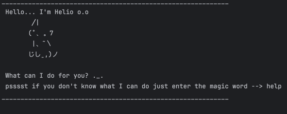

# Helio User Guide



Helio is a simple command-line chatbot task manager that helps you keep track of todos, deadlines, and events.
You can add, list, search, and manage your tasks easily from the terminal.

## Features
- [Adding todos](#adding-todos)
- [Adding deadlines](#adding-deadlines)
- [Adding events](#adding-events)
- [Listing tasks](#listing-tasks)
- [Marking a task](#marking-a-task)
- [Unmarking a task](#unmarking-a-task)
- [Deleting a task](#deleting-a-task)
- [Finding tasks](#finding-tasks)
- [Listing tasks on a date](#listing-tasks-on-a-date)
- [Help](#help)
- [Exiting Helio](#exiting-helio)

## Adding deadlines

Adds a task that must be done by a date (and optional time).

Example: `deadline return book /by 2025-10-03 1800`

```
Expected output:
 Got it!! I've added this task:
   [D][ ] return book (by: Oct 3 2025 18:00)
 Now you have 2 tasks in your list.
```

## Adding todo

Adds a simple task without date/time to your list.

Example: `todo read book`

```
Expected output:
Got it!! I've added this task:
  [T][ ] read book
Now you have 1 tasks in your list.
```

## Adding events

Adds a task that starts and ends at specified dates (and optional times).

Example: `event project meeting /from 2025-10-03 0900 /to 2025-10-03 1100`

```
Expected output:
Got it!! I've added this task:
  [E][ ] project meeting (from: Oct 3 2025 09:00 to: Oct 3 2025 11:00)
Now you have 3 tasks in your list.
```

## Listing tasks

Shows all tasks currently stored, with numbering.

Example: `list`

```
Expected output:
Here are the tasks in your list:
1. [T][ ] read book
2. [D][ ] return book (by: Oct 3 2025 18:00)
3. [E][ ] project meeting (from: Oct 3 2025 09:00 to: Oct 3 2025 11:00)

```
## Marking a task

Marks a task as done.

Example: `mark 2`

```
Expected output:
Yay! I've meowed this task as done:
 [D][X] return book (by: Oct 3 2025 18:00)
```
## Unmarking a task

Marks a task as not done.

Example: `unmark 2`

```
Expected output:
Aww okay... I've meowed this task as not done yet:
 [D][ ] return book (by: Oct 3 2025 18:00)
```
## Deleting a task

Removes a task from the list by its number.

Example: `delete 1`

```
Expected output:
Meow!! I've removed this task:
  [T][ ] read book
Now you have 2 tasks in the list:)
```
## Finding tasks

Searches for tasks whose descriptions contain a given word.

Example: `find book`

```
Expected output:
Here are the matching tasks in your list:
1. [D][ ] return book (by: Oct 3 2025 18:00)
```
## Listing tasks on a date

Shows deadlines/events that fall on a given date.

Example: `on 2025-10-03`

```
Expected output:
Here are the tasks on Oct 3 2025:
1. [D][ ] return book (by: Oct 3 2025 18:00)
2. [E][ ] project meeting (from: Oct 3 2025 09:00 to: Oct 3 2025 11:00)
```
## Help

Displays a list of valid commands.

Example: `help`

```
Expected output:
List of valid inputs:
  - list
  - mark <task number>
  - unmark <task number>
  - todo <description>
  - deadline <description> /by <yyyy-MM-dd> <optional: HHmm>
  - event <description> /from <yyyy-MM-dd> <optional: HHmm> /to <yyyy-MM-dd> <optional: HHmm>
  - delete <task number>
  - find <keyword>
  - on <yyyy-MM-dd>
  - help
  - bye
```
## Exiting Helio

Saves your tasks and exits the program.

Example: `bye`

```
Expected output:
Bye bye! Time for my nap!!
```
